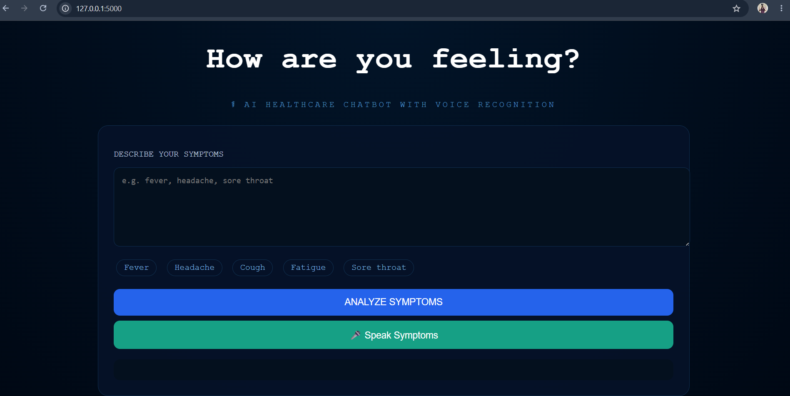
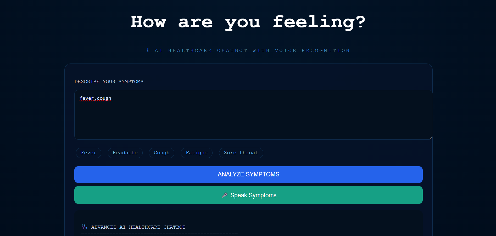
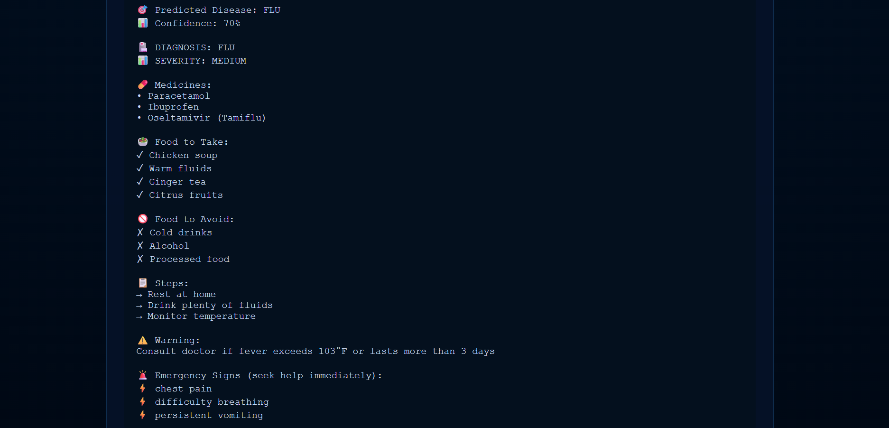

# AI Healthcare Chatbot with Voice Recognition

An AI-powered healthcare chatbot that predicts possible diseases from user symptoms. It supports both text and voice input and provides healthcare advice with voice output.

> This project is for educational purposes only. It is not a replacement for professional medical advice.

---

## Features

- Text-based symptom input
- Voice symptom input using Speech Recognition
- Disease prediction using Machine Learning
- Random Forest classifier
- Confidence score for prediction
- Health advice and precautions
- Medicine and food recommendations
- Emergency warning messages
- Text-to-Speech response
- Responsive web interface

---

## Technologies Used

- Python
- Flask
- HTML
- CSS
- JavaScript
- Scikit-learn
- Pandas
- Joblib
- Speech Recognition
- Text-to-Speech
- Random Forest Algorithm

---

## Project Structure

```text
AI-Healthcare-Chatbot/

|-- app.py
|-- train.py
|-- chatbot.py
|-- README.md
|
|-- data/
|   |-- symptoms_dataset.csv
|
|-- model/
|   |-- disease_classifier.pkl
|
|-- templates/
|   |-- index.html
|
|-- static/
    |-- images/
        |-- home-page.png
        |-- symptom-input.png
        |-- chatbot-output.png
```

---

## Project Screenshots

### Home Page



### Symptom Input



### Disease Prediction and Healthcare Advice



---

## Setup Virtual Environment

Create a virtual environment:

```bash
python -m venv venv
```

Activate the virtual environment.

### Windows

```powershell
venv\Scripts\activate
```

### Mac/Linux

```bash
source venv/bin/activate
```

---

## Installation

Install the required libraries:

```bash
pip install flask pandas scikit-learn joblib SpeechRecognition pyttsx3
```

---

## Run the Project

First, train the machine learning model:

```bash
python train.py
```

Then start the Flask application:

```bash
python app.py
```

Open the application in your browser:

```text
http://127.0.0.1:5000/
```

---

## Example Input

```text
fever, cough, body_pain
```

---

## Example Output

```text
Predicted Disease: FLU
Confidence: 89%

Medicines:
- Paracetamol
- Ibuprofen

Food to Take:
- Warm water
- Chicken soup

Warning:
Consult a doctor if symptoms become severe.
```

---

## Future Enhancements

- Add more diseases and symptom combinations
- Improve Natural Language Processing for normal sentences
- Add multilingual voice support
- Add user login and medical history
- Integrate real-time healthcare APIs
- Develop a mobile application
- Deploy the application using cloud platforms

---

## License

This project is created for academic and educational purposes.
